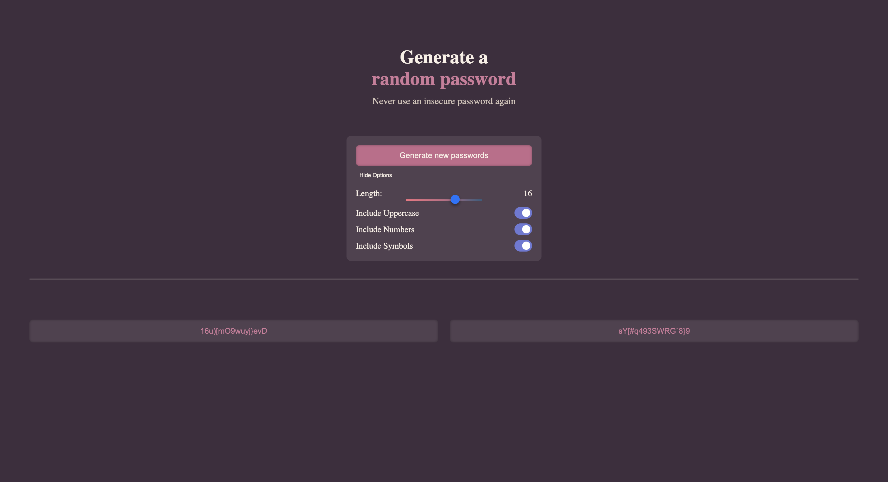

# 🔐 Random Password Generator

Generate secure, customizable passwords with style. This project helps users create strong passwords using a clean, dark-themed interface with options for length, symbols, numbers, and uppercase letters.

[](https://reliable-nasturtium-72cc13.netlify.app/)

## 🚀 Live Demo
👉 [Launch the app](https://reliable-nasturtium-72cc13.netlify.app/)

## ✨ Features

- 🎲 Generate two random passwords with a single click
- 🎚️ Adjustable length (8–20 characters) using a slider
- 🔠 Optional character types: uppercase, numbers, symbols
- 📋 One-click copy-to-clipboard for each password
- 🎨 Smooth animations and a responsive dark UI

## 🛠️ Built With

- [Vite](https://vitejs.dev/) – Fast dev + build tool
- Vanilla JavaScript (ES Modules)
- HTML & CSS

## 🧪 How to Run Locally

```bash
git clone https://github.com/ttvaroh/password-generator.git
cd password-generator
npm install
npm run dev